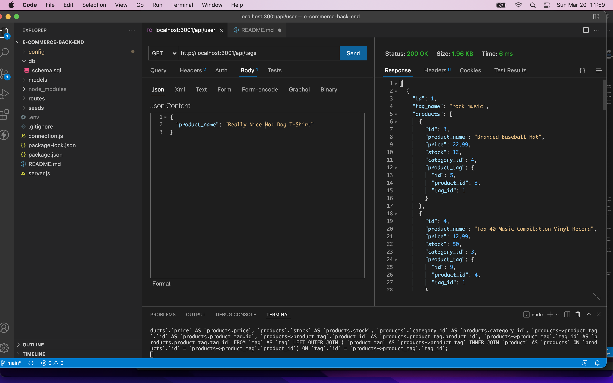

# 13 Object-Relational Mapping (ORM): E-Commerce Back End

## Description

Build the back end for an e-commerce site by modifying starter code. You’ll configure a working Express.js API to use Sequelize to interact with a MySQL database.

## Table of Contents

- [Screenshot](#screenshot)
- [Installation](#installation)
- [Usage](#usage)
- [Contribute](#contribute)
- [Questions](#questions)
- [Links](#links)

## Screenshot

## Installation

The user must install mySQL, dotenv, express, and sequelize to run this application.

## Usage

Use this application to track your products.

## Contribute

Contact the application owner.

## Questions

If you have any questions, please contact:

- Brett Gould
- bgould86@gmail.com
- [https://www.github.com/bgould86](https://www.github.com/bgould86)

## Links

- Here is the repo: [https://github.com/bgould86/e-commerce-back-end](https://github.com/bgould86/e-commerce-back-end)
- Here is the video walk through: [https://www.youtube.com/watch?v=JBBfY5smy2k](https://www.youtube.com/watch?v=JBBfY5smy2k)
